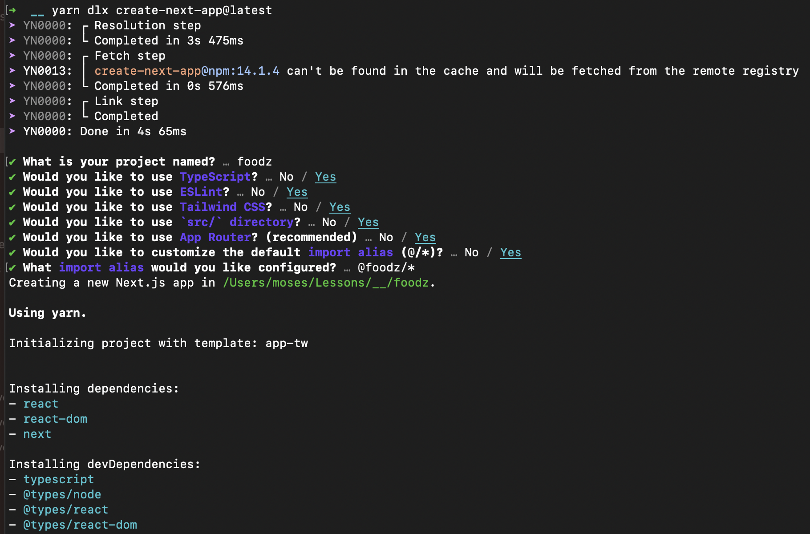

### Environment Setup

For this project, Yarn berry is used as the package manager. To setup Yarn berry do the following:

1. Ensure you have NodeJS version 16 or higher installed

```bash
node -v # should return the version of node installed
```

2. Corepack is a NodeJS cli tool that helps install package managers. Use it to install yarn

```bash
corepack enable # enables the corepack tool if it's not enabled
corepack prepare --all # installs the package managers (npm, yarn, pnpm)
```


3. Verify that you have yarn berry version

```bash
yarn -v # -> 3.6.0
```


### Project Setup Steps

1. Create a new Next JS project. Answer all the question as shown in the screenshot below. After the project is done bootstrapping, a git repo will be automatically initialised.

```bash
yarn dlx create-next-app@latest
```



2. Open the project in your editor and access the terminal. Set the latest version of `yarn berry` as the package manager.

```bash
yarn set version berry
```


3. In your editor, notice a new file `.yarnrc.yml`. Update it to look like the one in the screenshot below


4. Delete the following files

```bash
yarn.lock
.pnp.cjs
.pnp.loader.mjs
```

4. In the project terminal, re-install the project dependencies to force to use node modules folder.

```bash
yarn install
```

5. Notice changes in your project's git history by running

```bash
git status
```

6. Commit the changes by running the following one after the other

```bash
git add .
git commit -m "chore: configure package manager"
```

7. Install `shadcn-ui`

```bash
yarn add --dev shadcn-ui
```

8. Setup shadcn-ui

```bash
yarn shadcn-ui init
```


9. Edit the alias section of `components.json` to match the following

```json
"aliases": {
    "components": "@foodz/components",
    "utils": "@foodz/components/utils"
}
```

10. Create `components` folder under src. Copy `@/lib/utils.ts` to `src/components/utils.ts`.

11. Delete the `@` folder.


12. Add the following to scripts section in `package.json`

```json
"ui": "shadcn-ui add"
```


13. In the project terminal, run the following command. If there are no errors, it means shadcn is properly configured

```bash
yarn ui button
```

14. Run `yarn dev` in the project terminal to start the project and verify if it successfully compiles.

15. Add and commit the changes to git.

```txt
you should be able to do so on your own
```
